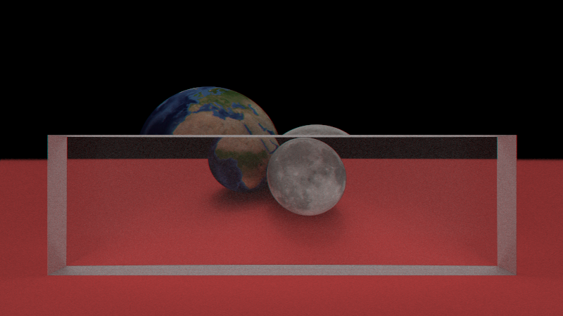
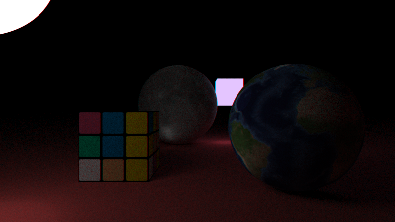

# Ray Tracing





## Scene description

### Objects

```XML
<object geometry="sphere">
    <center>
        <x>0.0</x>
        <y>0.0</y>
        <z>0.0</z>
    </center>
    <radius>1.0</radius>
    <material>...</material>
</object>
```

```XML
<object geometry="plane">
    <point>
        <x>0.0</x>
        <y>0.0</y>
        <z>0.0</z>
    </point>
    <normal>
        <x>0.0</x>
        <y>0.0</y>
        <z>1.0</z>
    </normal>
    <material>...</material>
</object>
```

```XML
<object geometry="quad">
    <point>
        <x>0.0</x>
        <y>0.0</y>
        <z>0.0</z>
    </point>
    <vector_u>
        <x>1.0</x>
        <y>0.0</y>
        <z>0.0</z>
    </vector_u>
    <vector_v>
        <x>0.0</x>
        <y>1.0</y>
        <z>0.0</z>
    </vector_v>
    <material>...</material>
</object>
```

```XML
<object geometry="box">
    <center>
        <x>0.0</x>
        <y>0.0</y>
        <z>0.0</z>
    </center>
    <sizes>
        <x>1.0</x>
        <y>1.0</y>
        <z>1.0</z>
    </sizes>
    <material>...</material>
</object>
```

### Materials

```XML
<material appearance="light" texture="...">
    ...
</material>
```

```XML
<material appearance="lambertian" texture="...">
    ...
</material>
```

```XML
<material appearance="metal" texture="...">
    <fuzzy>0.2</fuzzy>
    ...
</material>
```

```XML
<material appearance="dielectric" texture="...">
    <refractive_index>1.5</refractive_index>
    ...
</material>
```

### Textures

```XML
<material appearance="..." texture="solid">
    ...
    <albedo>
        <r>1.0</r>
        <g>1.0</g>
        <b>1.0</b>
    </albedo>
</material>
```

```XML
<material appearance="..." texture="checker">
    ...
    <odd>
        <r>1.0</r>
        <g>0.0</g>
        <b>0.0</b>
    </odd>
    <even>
        <r>0.0</r>
        <g>0.0</g>
        <b>1.0</b>
    </even>
</material>
```

```XML
<material appearance="..." texture="image">
    ...
    <filename>path/to/image.png</filename>
</material>
```

### Combining them

```XML
<object geometry="sphere">
    <center>
        <x>0.0</x>
        <y>0.0</y>
        <z>0.0</z>
    </center>
    <radius>1.0</radius>
    <material appearance="dielectric" texture="solid">
        <refractive_index>1.5</refractive_index>
        <albedo>
            <r>1.0</r>
            <g>1.0</g>
            <b>1.0</b>
        </albedo>
    </material>
</object>
```

```XML
<object geometry="box">
    <center>
        <x>0.0</x>
        <y>0.0</y>
        <z>0.0</z>
    </center>
    <sizes>
        <x>1.0</x>
        <y>1.0</y>
        <z>1.0</z>
    </sizes>
    <material appearance="lambertian" texture="image">
        <filename>textures/rubik.png</filename>
    </material>
</object>
```
